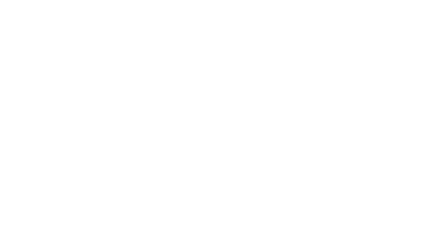
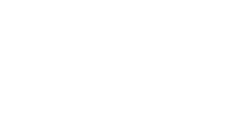

---
author:
- Sarah Alanazi
- Jacan Chaplais
title: Differential cross section for Compton scattering
title-slide-attributes:
    data-background-image: images/bg.jpg
    data-background-size: cover
    data-background-opacity: 0.3
slideNumber: 1
transition: convex
transitionSpeed: slow
date: April, 2021
lang: en-GB
...

## Outline {
data-background-image='images/waves.jpg'
data-background-opacity=0.3
}

::: incremental
* Motivation
* Theory
    * Frames of reference
    * The invariant amplitude
    * Phase space integrals
* Method
:::

## Test slide blah blah {
data-background-image='images/waves.jpg'
data-background-opacity=0.3
}

:::::::::::::: {.columns}
::: {.column width="45%"}
Lorem ipsum dolor sit amet, consectetur adipiscing elit, sed do eiusmod tempor
incididunt ut labore et dolore magna aliqua. Ut enim ad minim veniam, quis
nostrud exercitation ullamco laboris nisi ut aliquip ex ea commodo consequat.
Duis aute irure dolor in reprehenderit in
:::
::: {.column width="45%"}
voluptate velit esse cillum dolore eu fugiat nulla pariatur. Excepteur sint
occaecat cupidatat non proident, sunt in culpa qui officia deserunt mollit anim
id est laborum.
:::
::::::::::::::

## Scattering formula {
data-background-image='images/waves.jpg'
data-background-opacity=0.3
}

$$
\frac{1}{\omega^\prime}-\frac{1}{\omega}=\frac{1}{m}(1-\cos \theta)
$$

test change.

## Centre-of-mass frame {
data-background-image='images/waves.jpg'
data-background-opacity=0.3
.allowframebreaks
}

Let me write a lot of text here.
Will it adjust the size?
Who knows?
Who knows?
Who knows?
Who knows?
Who knows?
Who knows?

::: notes
I should probably reduce the size of the text here

:::

## Lab frame {
data-background-image='images/waves.jpg'
data-background-opacity=0.3
}

